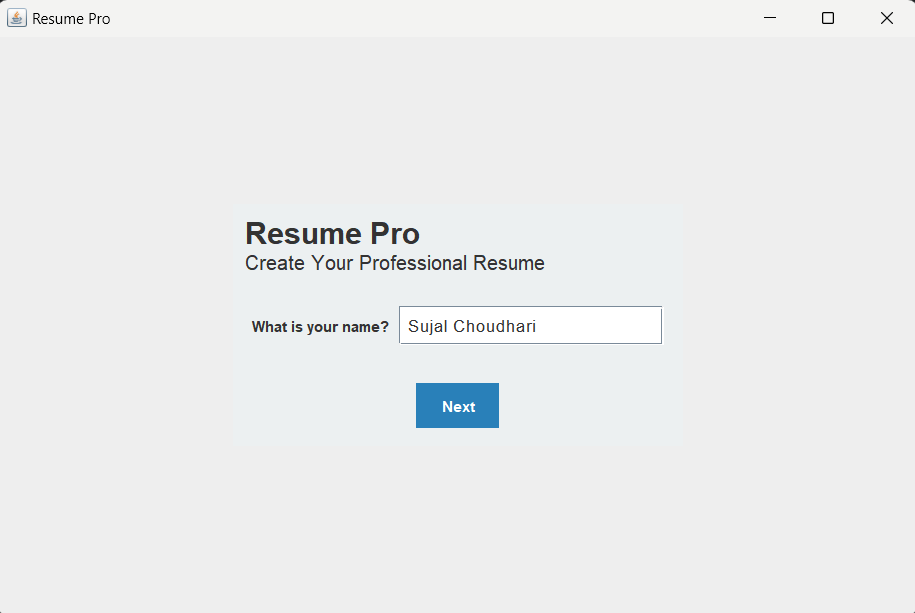
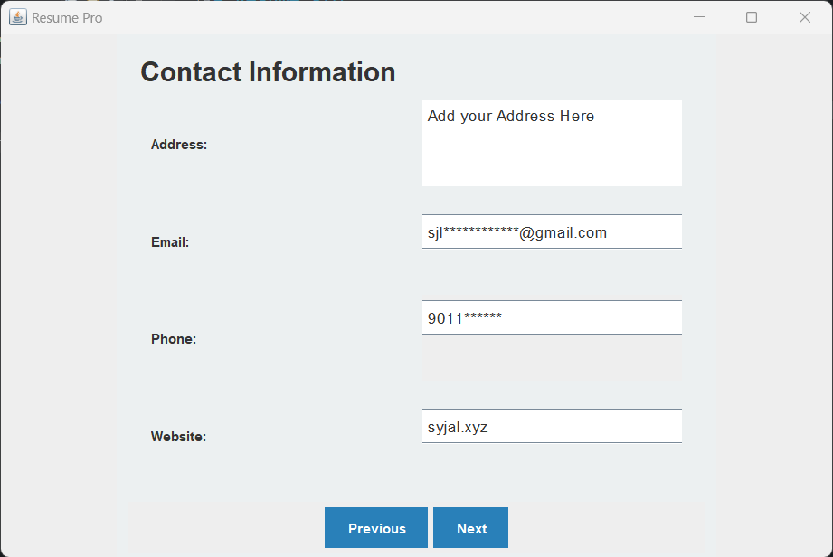
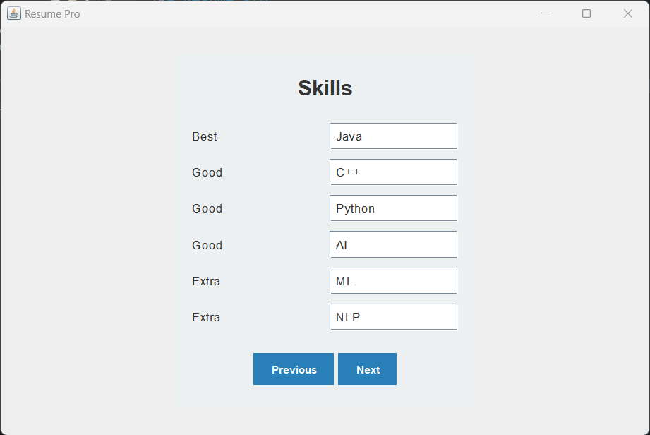
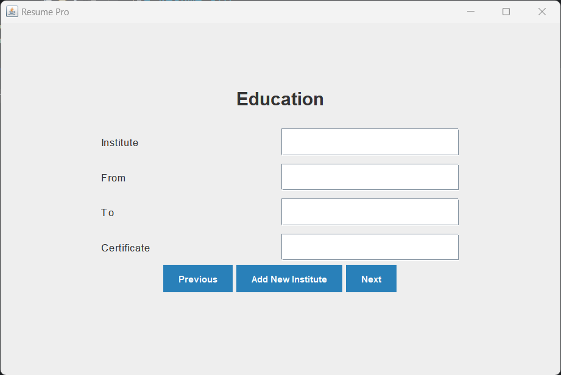
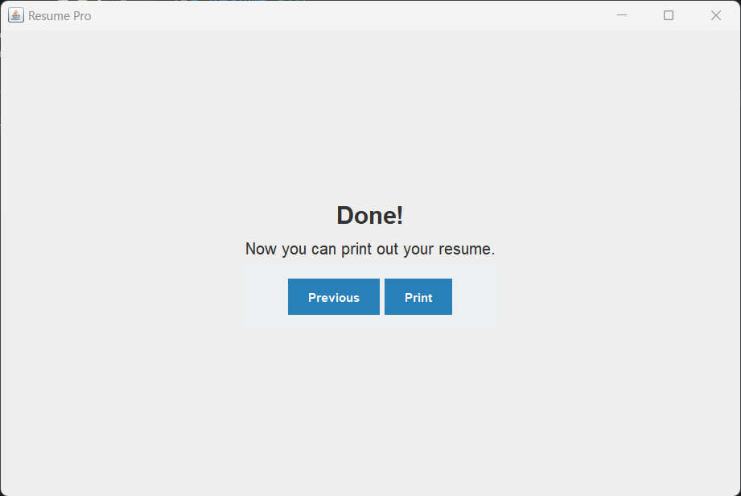

# Resume Pro

Resume Pro is an intuitive application for creating resumes with a user-friendly UI. 
It allows users to enter their personal details and converts them into a simple PDF file.

## Features

Resume Pro offers the following features:

- User-friendly UI for entering personal details
- Conversion of entered details into a simple PDF file

## Screenshots

Please find below some screenshots of the Resume Pro application.

*Figure 1: Username Input*

*Figure 2: Contact Information*

*Figure 3: Skills Information*

*Figure 4: Experience Information*

*Figure 5: Finalized resume PDF*

Please note that the provided screenshots are for illustrative purposes and may vary from the actual application.

## Tools Used

Resume Pro is developed using the following tools:

- Java
- Swing
- iTextpdf v5.5.13.3

## Getting Started

To get started with Resume Pro, follow these steps:

1. Clone the repository: `git clone https://github.com/SujalChoudhari/ResumePro.git`
2. Install the required dependencies: `itextpdf 5.5.13.3`
3. Run the application in your favorite IDE. 

## License

Resume Pro is released under the [MIT License](LICENSE).

## Contributing

Contributions are welcome! Create Issues for contributions on certain parts.

## Support

If you encounter any issues or have any questions, please [create an issue](https://github.com/SujalChoudhari/ResumePro/issues) in the repository.
